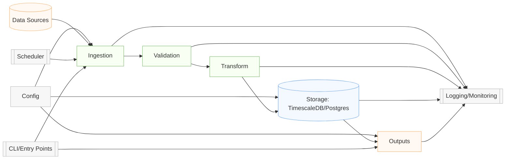

# Data Module Architecture

This document describes the internal architecture and data flow of the **data module**.

## Overview

## Components

- **Data Sources**: External providers such as yfinance.
- **Scheduler**: cron/CI triggers for periodic ingestion.
- **Config**: .env / YAML settings for credentials and parameters.
- **CLI**: Command-line interfaces or scripts to run ad-hoc tasks.
- **Ingestion**: Jobs/services that fetch raw OHLCV and metadata.
- **Validation**: Schema checks using JSON Schema / Pydantic to ensure data quality.
- **Transform**: Cleaning, normalization, feature enrichment.
- **Storage**: PostgreSQL/TimescaleDB hypertables for time-series data.
- **Outputs**: Exports (CSV), reports, and charts consumed by downstream modules.
- **Logging**: Centralized logs/metrics for observability and alerting.

## Notes

- Keep this diagram text-based (Mermaid) to ease versioning and reviews.
- Update node labels with concrete module/file names as the implementation stabilizes.
